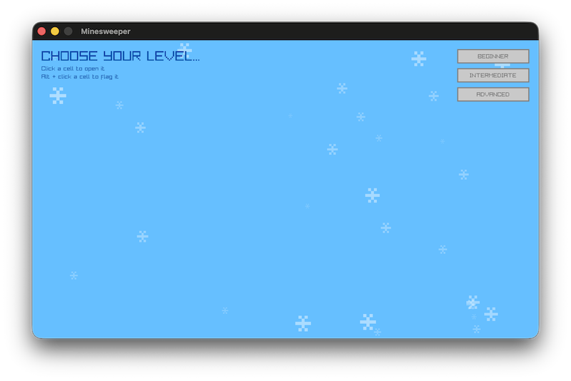
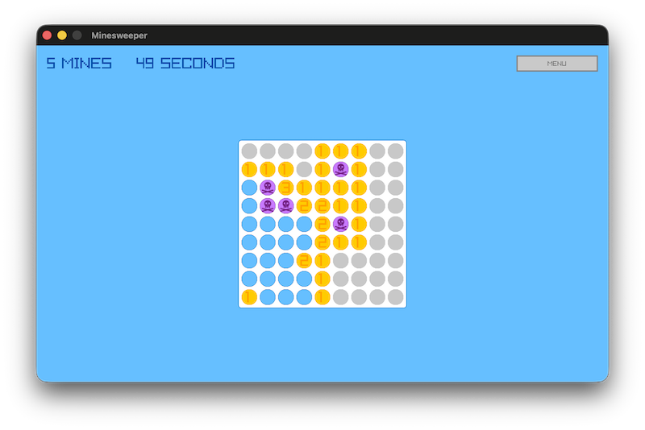
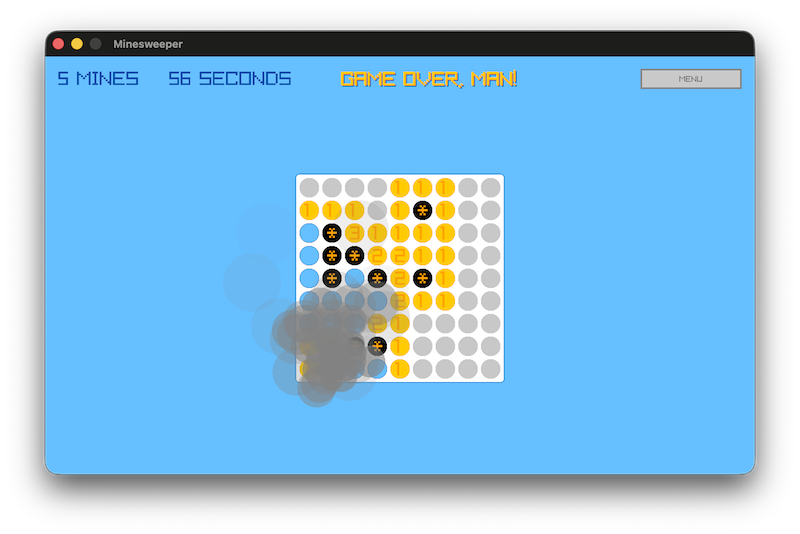

# Minesweeper

I wrote this to learn Odin + raylib. I know it's not as cool as snake, but I thought it might be a good example anyway.







Potentially interesting bits...
* raylib graphics (of course)
* raylib textures
* raylib audio
* raylib GUI (`GuiButton`)
* Multiple animation techniques: frame delta, animation frame index, and particles
* Modified particle system based on the raylib Simple Particles example
* 1 file that is ~650 LoC

# Build

No binaries. You will need to build Minesweeper if you want to play it.

1. [Install Odin](https://odin-lang.org/docs/install/) if you haven't done so already

2. Clone this repository
```console
git clone https://github.com/chris-braun/minesweeper.git
```

3. Run it with Odin
```console
cd minesweeper
odin run .
```
